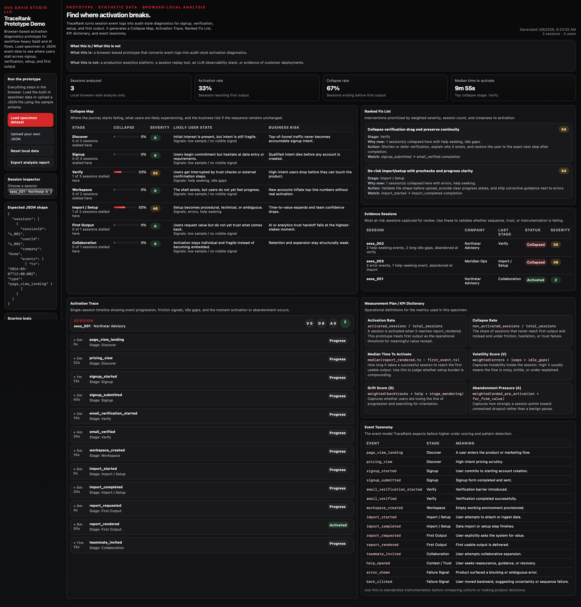
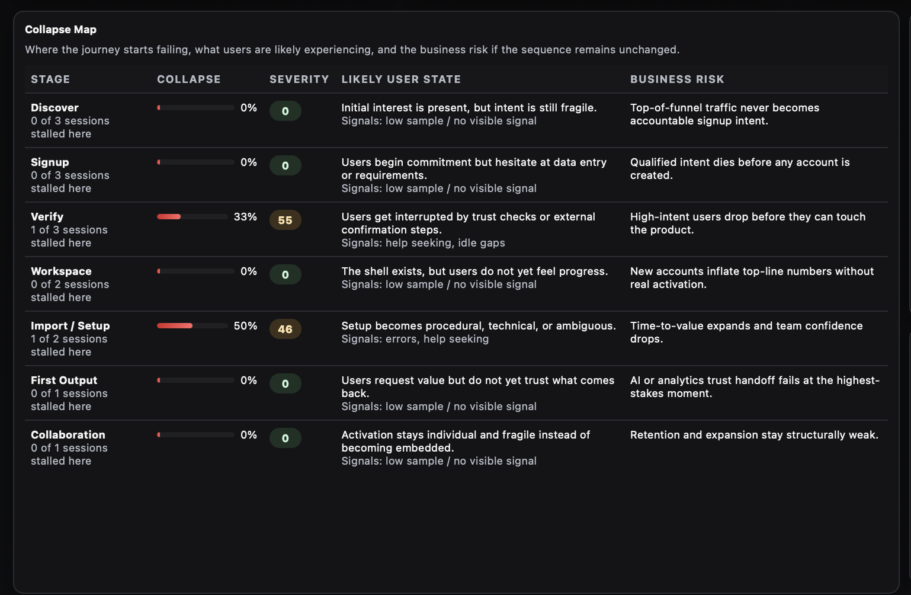
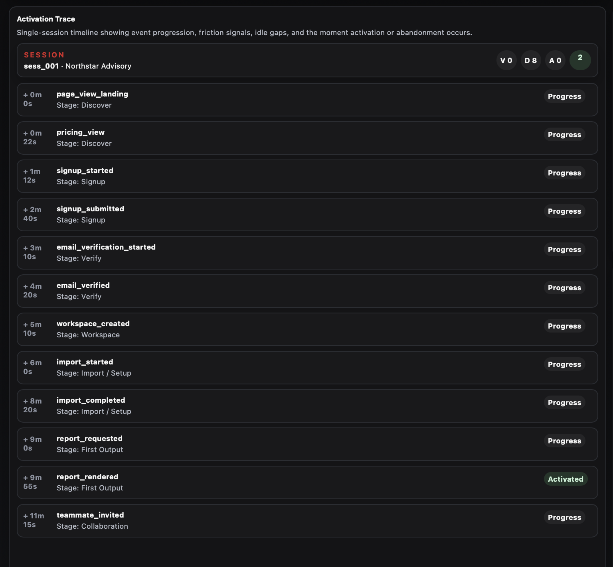
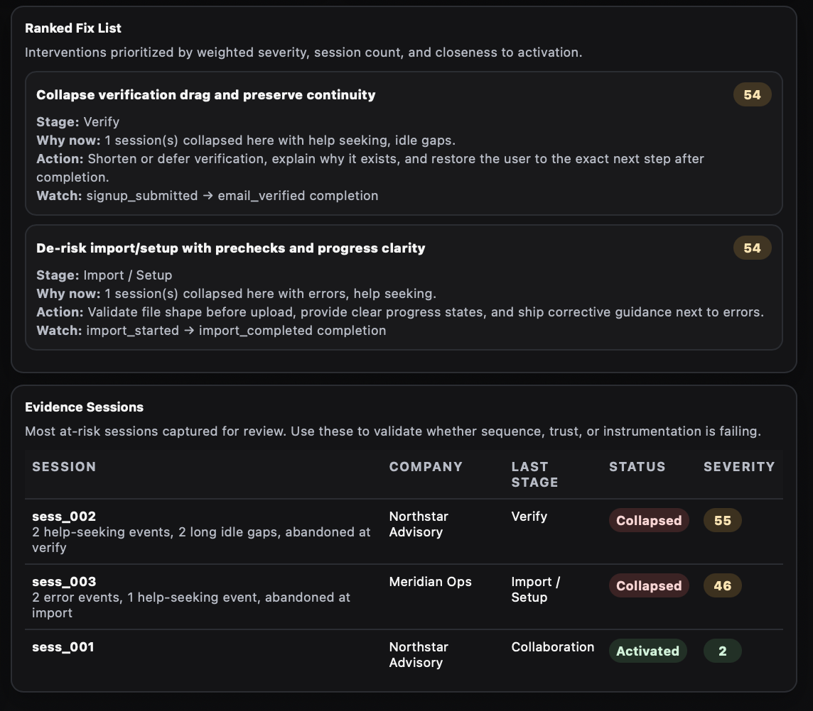
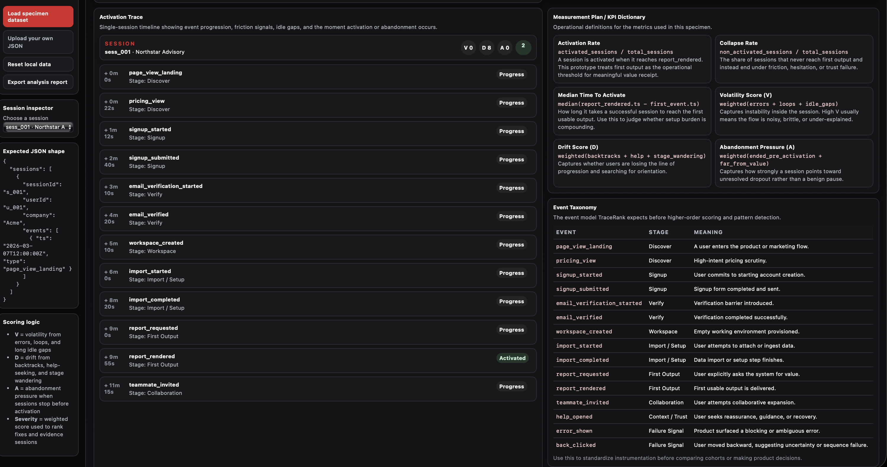
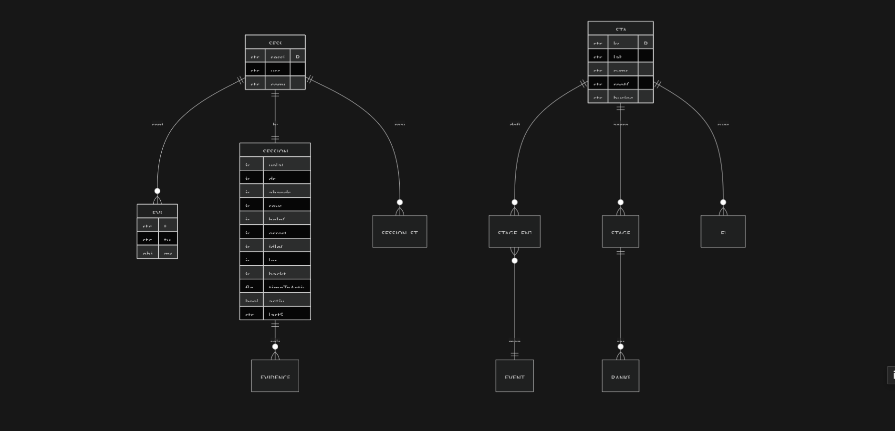

# TraceRank Prototype

TraceRank is a public-safe behavior forensics prototype for workflow-heavy SaaS and AI journeys.

It ingests synthetic specimen event logs and generates audit-style diagnostic outputs instead of surface-level analytics dashboards.

## Live demo

Demo: https://avadavisstudio.github.io/tracerank-prototype/  
Repo: https://github.com/avadavisstudio/tracerank-prototype

## What this prototype produces

- Collapse Map
- Activation Trace
- Ranked Fix List
- Measurement Plan / KPI Dictionary
- Evidence Sessions
- Event Taxonomy

## What this proves

This prototype demonstrates a state-first diagnostic method:

- raw event logs can be converted into decision-grade journey diagnostics
- collapse can be surfaced by stage, symptom, and business risk
- friction can be translated into ranked interventions instead of vague analytics commentary
- instrumentation can be standardized before higher-order product decisions are made

## Public-safe note

This prototype uses synthetic specimen data only.

It contains no client data, no production exports, and no implied customer outcomes or production deployment.

## Core scoring model

TraceRank scores three primary forms of collapse:

- **Volatility (V):** errors, loops, unstable sequence behavior, long idle gaps
- **Drift (D):** backtracks, help-seeking, stage wandering, loss of progression
- **Abandonment pressure (A):** sessions that stop before meaningful completion

These signals are combined into a weighted severity model so the system can rank where intervention matters most.

## Current prototype capabilities

- analyze a JSON event log in-browser
- inspect per-session collapse patterns
- surface collapse stages and likely user state
- rank interventions by weighted severity
- export a structured analysis report
- demonstrate public-safe specimen outputs for audit-style presentation

## Quickstart

1. Open the live demo.
2. Click **Load specimen dataset**.
3. Review the Collapse Map, Ranked Fix List, Evidence Sessions, Activation Trace, and Measurement Plan.
4. Export the report.

## Screens

## Why this exists

Most teams can track clicks, views, and drop-off rates, but still cannot clearly see where users hesitate, loop, lose trust, drift off-path, or abandon before value.

TraceRank is a prototype built to test a state-first diagnostic model that converts event streams into audit-style outputs.

## Roadmap

Next iterations:

- CSV ingestion
- saved audits
- richer visual exports
- multi-project analysis
- stronger weighting controls
- deck-ready specimen output

## Author

Ava Davis  
Ava Davis Studio LLC  
State-First Architecture Lab

## License

MIT
